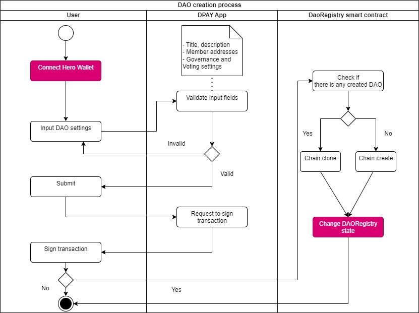
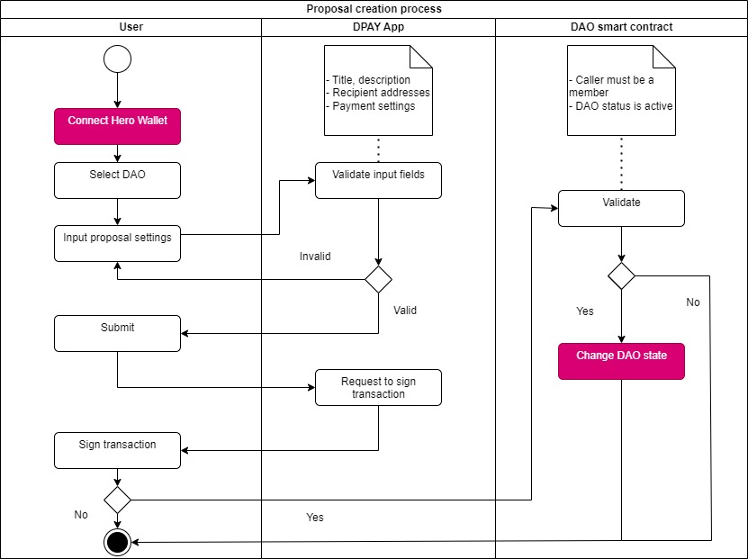

# **DPAY** - A DAO platform for payroll and vesting on Æternity.
## Description
DPAY allows users to create DAOs and SubDAOs, create payment proposals, conduct voting, and manage the treasury. With a wide range of options, DPAY intends to be a platform that every team, company, and organization can use to pay salaries or invest using AE tokens.

DPAY works with Hero Wallet and on the Æternity mainnet.

Web URL: [DPAY](https://dpay.a2n.finance)

## Getting Started
These are instructions on how to install and run your dApp. Include prerequisites, installation steps, and commands needed to start the application.

### Prerequisites
- Have basic knowledge about Javascript & React App.
- NodeJS 16+
- A Wallet: We're highly recommend Hero Wallet, you can install it as a browser extension, you can switch between mainnet and testnet easily. 

### Installation Steps
- Create an account to deploy smart contract
    - Install `aepp-cli`: `npm install --global @aeternity/aepp-cli`
    - Create new account: `aecli account create my-ae-wallet --password 12345`
    - View the address: `aecli account address my-ae-wallet`
    - Get the private key of your new account: `aecli account address my-ae-wallet --privateKey`
    - If you want to deploy smart contract on the AEternity mainnet, you need to fund your account.
- Copy .env.example to .env.local
- Change settings in .env.local
    - `NEXT_PUBLIC_NETWORK_TYPE`: tesnet or mainnet.
    - `NEXT_PUBLIC_DAO_REGISTRY_ADDRESS`: your deployed DAORegistry smart contract address.
    - `SECRET_KEY`: your account private key.
- Install dependencies: `npm i`

### Commands to start 
- To deploy smart contracts on the AEternity testnet: `npm run deploy-testnet`
- To deploy smart contracts on the AEternity mainnet: `npm run deploy-mainnet`
- To run unit tests:
    - For DAORegistry contract: `npm run test-dao-registry`
    - For DAO contract: `npm run test-dao`
    - for all smart contracts and generate reports: `npm run test`
- Run this app on Dev mode: `npm run dev`
- Run this app on Production mode: `npm run build` and `npm run start`
- If you're using Windows OS, you have to use WSL2 to run deploy and test commands.

## Technologies Used
List the technologies and tools used to build this app, including programming languages, frameworks, and libraries.

### Programming languages
- Javascript
- Sophia
- TypeScript
### Frameworks
- React 18
- NextJS 12.1
### Libraries
- Aepp-sdk
- Aeproject: for testing purpose.
- Ant Design: to develop UI/UX.
## Test Reports

DPAY uses AEproject, Mocha, and MochaAwesome to do automation test.

You can see reports at here: [https://dpay.a2n.finance/test-report/dpay.html](https://dpay.a2n.finance/test-report/dpay.html)

## Smart Contracts
Our main smart contract is DAORegistry, which is used to create and store basic data for DAOs and SubDAOs.

### Create DAO process

### Create Proposal process

### Other processes

Other processes include the Fund Process, Add/Remove Member Processes, and Vote/Execute Proposal Processes.

You can see detailed diagrams [here](docs/processes.md)

## Usage
To use this app on any web browser, use this url: [https://dpay.a2n.finance](https://dpay.a2n.finance)
- To create DAO: click on New DAO menu
- To create SubDAO: select a DAO, click on New SubDAO button
- To create a proposal: select a DAO/SubDAO, click on New Proposal button
- To fund a DAO or SubDAO, we have two ways: 
    - Select DAO, Click on Send Fund button
    - Select DAO, Create a payment proposal within a DAO and add recipient addresses.
- To add and remove member: select a DAO, click on Add or Remove Member button.
- To Join an openned DAO, click on Join button.

## Contributing
While this application is functional, there are areas that can still be improved, such as UI/UX, security, and smart contract functionality, as well as adding new features. We welcome any ideas or suggestions to help us make this app better. Please do not hesitate to contact us via email at john@a2n.finance.

## Acknowledgments
We would like to express our gratitude to Æternity open-source projects, as well as the Æternity chat channel on Discord. Without the high-quality libraries and support from the Æternity community, we could not have completed this application.

## Contact

If you have any questions, please do not hesitate to contact us via email at john@a2n.finance.

## License
This package is released under the [BSL 1.1 License](LICENSE).

